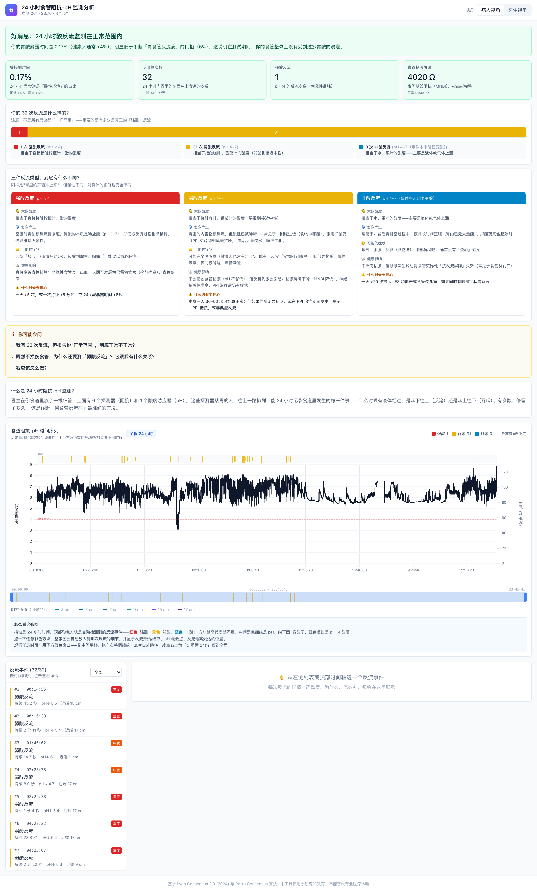
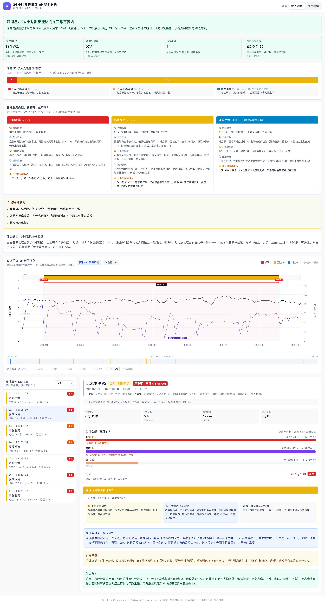
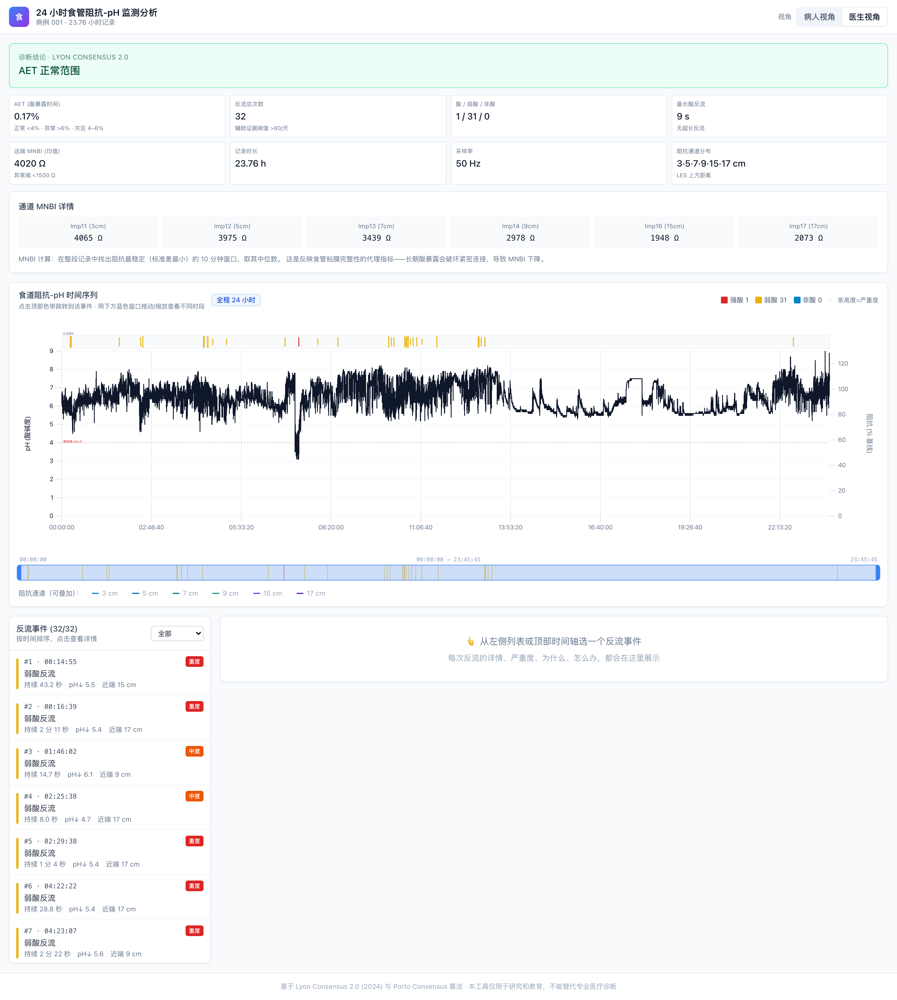
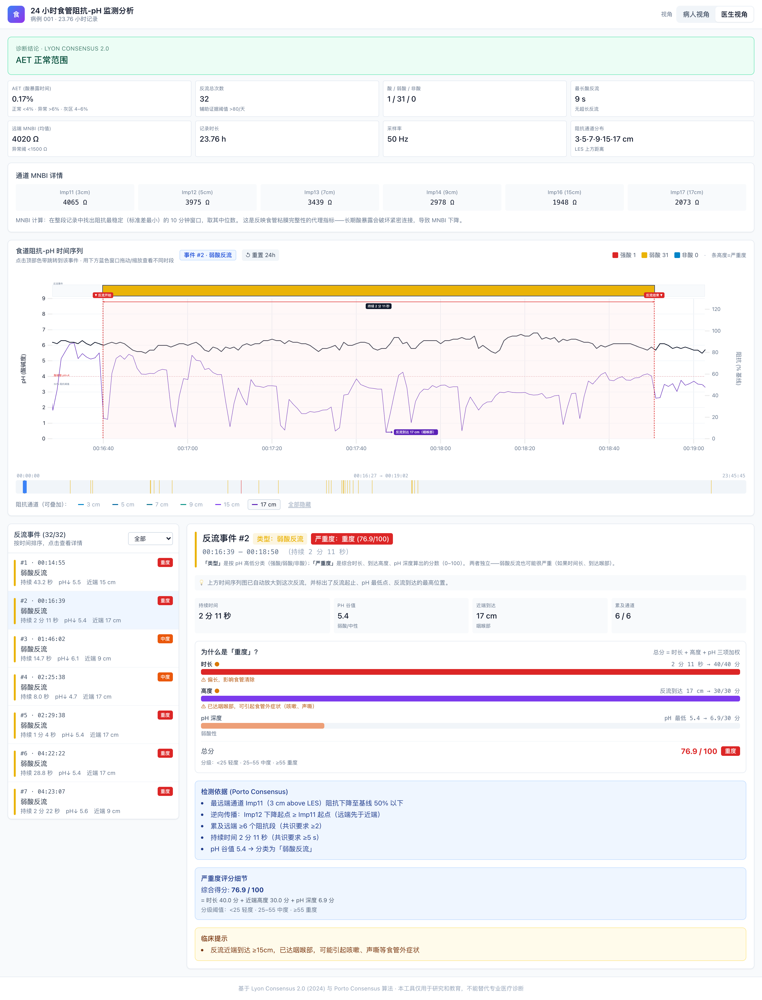

# GERD Monitor — 24h pH-Impedance Analysis for Patients and Clinicians

Interactive, browser-based analysis of 24-hour multichannel intraluminal impedance-pH (MII-pH) monitoring data — the gold-standard test for gastroesophageal reflux disease (GERD). Automatic reflux event detection based on **Lyon Consensus 2.0 (2024)** and **Porto Consensus**, with two distinct UI modes designed for *patients* and *clinicians*.

🌐 **Live demo:** https://gerd-001.pages.dev
📹 **Video walkthrough:** [reflux-timeline-demo.mov on Releases](https://github.com/scintiller/gerd-monitor/releases/download/v0.1/reflux-timeline-demo.mov) (~120 MB)

---

## The Problem

24-hour MII-pH monitoring is the gold standard for diagnosing GERD and characterizing reflux. A typical study produces:

- **13 channels** of physiological data (1 pH probe + 6 impedance segments along the esophagus + 6 reference electrodes)
- **50 Hz sampling** for 24 hours → roughly **55 million data points** per study
- A raw CSV in the **500 MB** range

The data flow today is broken in three ways:

1. **Existing clinical software is desktop-only and proprietary** — Sandhill BioVIEW, MMS, Diversatek, etc. require Windows installs, dongles, hospital licenses; nothing runs in the browser.
2. **Patients see almost none of it.** They get a one-page printed summary they cannot interpret, and the underlying study (which they paid for) lives on a hospital workstation forever.
3. **Even physicians review most studies the same way** — scrolling through hours of data manually, looking for obvious drops. Reflux event detection is rule-based, well-specified by international consensus, and trivially scriptable, yet most clinicians still do it visually.

The result: a $500 / ¥3000+ test with rigorous data backing it, but most of the signal never reaches the patient, and a meaningful fraction of physician time is spent on tasks that should be automated.

## What This Project Does

A static web application that:

1. **Parses raw MII-pH CSV** (Sandhill-style 13-channel format, 24h × 50 Hz).
2. **Detects every reflux event automatically** using the international consensus algorithm:
   - **Acid reflux** — pH drops from >4 to <4, sustained ≥5 s
   - **Bolus reflux (any pH)** — distal impedance falls to ≤50 % of baseline, propagates retrograde (distal-then-proximal) across ≥2 channels, sustained ≥5 s
   - Per-event classification (acid / weakly acidic / non-acid), proximal extent, pH nadir, severity score
3. **Computes Lyon Consensus 2.0 parameters** — AET, MNBI, total reflux episodes, longest acid episode, supportive evidence.
4. **Presents the result two ways:**

| Mode | Designed for | What you see |
|------|--------------|--------------|
| 🧑 **Patient view** | Anyone who took the test | Plain-language diagnosis, "what does this mean for me", FAQ ("I had 32 reflux events — is that normal?"), 3 reflux types compared with food analogies, per-event "what you might feel / what it does to your body" |
| 🩺 **Clinician view** | Gastroenterologists, GPs reviewing the study | AET / MNBI / Porto detection criteria checklist / severity score breakdown / channel-by-channel MNBI / diagnostic conclusion per Lyon 2.0 thresholds |

5. **Runs entirely in the browser.** No server, no install, no data leaves your machine. Cloudflare Pages or any static host.

## Who Is This For

### Patients with reflux symptoms

You had a 24-hour pH study. The doctor's report says *"AET 4.5%, 32 episodes — borderline"* and you have no idea what that means. Upload the CSV your hospital gave you (most centers will burn it to a disc on request) and you'll see:

- A traffic-light diagnosis you can read in 30 seconds
- For every single reflux event over 24 hours: *when*, *how acidic*, *how high up your esophagus it went*, *what symptoms it might explain*, *whether it's worth worrying about*
- Why "32 events" might still be normal (it usually is — what matters is acid exposure *time*, not count)
- What questions to ask your doctor next

### Gastroenterologists & general practitioners

You read MII-pH studies and want:

- Lyon Consensus 2.0 conclusion at a glance (AET vs 4 % / 6 % thresholds, MNBI vs 1500 Ω, supportive evidence)
- Every reflux event Porto-classified with audit trail (which channels involved, propagation pattern, pH nadir, exact timing)
- A patient-shareable URL you can drop in WeChat / a patient portal so they understand their own data — improves adherence, reduces follow-up phone calls
- A clean way to teach trainees what reflux looks like on impedance (the chart annotations explain *why* each event qualifies)

### Researchers

- Reference implementation of Lyon 2.0 + Porto detection in Python (`scripts/preprocess.py`)
- Easy to run on a cohort: drop CSVs in, get a directory of processed JSON
- All thresholds are configurable constants — easy to study sensitivity

## Screenshots

### Patient view — overview

The landing page for non-experts: diagnosis as plain text, four big stats, a visual breakdown of *what kind* of reflux you have, side-by-side comparison of the three reflux categories, and a FAQ answering the questions most patients actually ask.



### Patient view — clicking a reflux event

Click any event in the timeline or list, and the chart auto-zooms to a ±12 s window with annotations: where reflux started/ended, the pH nadir, and how high in the esophagus it reached. The severity score is broken down into its three components (duration / proximal extent / pH) so it's obvious *why* the event is rated severe vs. mild.



### Clinician view — diagnostic summary

Same data, professional presentation. AET, MNBI per channel, Lyon 2.0 conclusion with thresholds, supportive evidence, channel topology.



### Clinician view — per-event audit

Every Porto consensus criterion verified inline. Severity breakdown shows the math, not just the label.



## Try It

- **Sample case (Case 001):** open https://gerd-001.pages.dev — anonymized patient data is pre-loaded
- **Your own data:** [upload feature coming next — see roadmap below]

## How It Works

| Layer | Technology |
|-------|------------|
| Frontend | React + TypeScript + Vite + TailwindCSS |
| Charting | [uPlot](https://github.com/leeoniya/uPlot) — handles millions of points at 60 fps |
| Detection algorithm | Python (pandas, numpy) — see `scripts/preprocess.py` |
| Hosting | Cloudflare Pages (static, free, globally CDN'd) |

Algorithm constants and thresholds are documented inline in `scripts/preprocess.py` with citations:

- Gyawali CP et al. *Updates to the modern diagnosis of GERD: Lyon Consensus 2.0.* Gut 2024.
- Sifrim D et al. *Acid, nonacid, and gas reflux in patients with gastroesophageal reflux disease.* Gastroenterology 2001.
- Roman S et al. *Ambulatory reflux monitoring for diagnosis of gastro-esophageal reflux disease: Update of the Porto consensus.* Neurogastroenterol Motil 2017.

## Local Development

```bash
# 1. Decompress the sample raw data (one-time)
brew install unar
unar 001.rar

# 2. Set up Python preprocessing
brew install uv
uv venv --python 3.12 .venv
uv pip install pandas numpy scipy pyarrow
.venv/bin/python scripts/preprocess.py
cp -r data/processed/* web/public/data/

# 3. Run the web app
cd web
npm install
npm run dev
# → http://localhost:5173
```

## Deployment

```bash
cd web
npm run build
npx wrangler pages deploy dist --project-name=gerd-001 --branch=main
```

Re-running the same command pushes updates.

## Project Structure

```
.
├── scripts/preprocess.py      # Reflux detection algorithm (Lyon 2.0 / Porto)
├── data/processed/            # Compact JSON output (~12 MB total)
│   ├── summary.json           # Global metrics, diagnosis, MNBI
│   ├── events.json            # All detected reflux events with annotations
│   └── overview.json          # 1 Hz downsampled time series for charting
├── web/
│   ├── src/
│   │   ├── App.tsx, main.tsx
│   │   ├── components/        # Timeline, EventList, EventDetail, etc.
│   │   ├── explain.ts         # Clinical reasoning → plain language
│   │   ├── data.ts            # JSON loaders
│   │   └── types.ts
│   ├── public/data/           # Static-served JSON (copy of data/processed/)
│   └── scripts-screenshots.mjs # Puppeteer screenshot automation
├── docs/screenshots/          # README assets
└── README.md
```

## Privacy

The sample case (Case 001) is anonymized — the original CSV contains a real patient name in the header that has been replaced with "Case 001" on the deployed site. The raw 524 MB CSV and 66 MB RAR are excluded from this repository (`.gitignore`).

When the upload feature ships, **uploaded files are processed entirely client-side** — your data never leaves your browser. Nothing is sent to any server.

## Roadmap

- [ ] **In-browser CSV upload** (port detection algorithm from Python to TypeScript / WebWorker)
- [ ] Symptom marker overlay (patient self-reported symptoms during the study)
- [ ] Sleep/upright split for DeMeester score
- [ ] PDF clinical report export
- [ ] Batch analysis mode for research cohorts

## Disclaimer

This tool is intended for **research and educational purposes** and provides **no medical diagnosis or treatment recommendation**. Clinical decisions must be made by a licensed physician with access to the full clinical context.

## License

MIT
